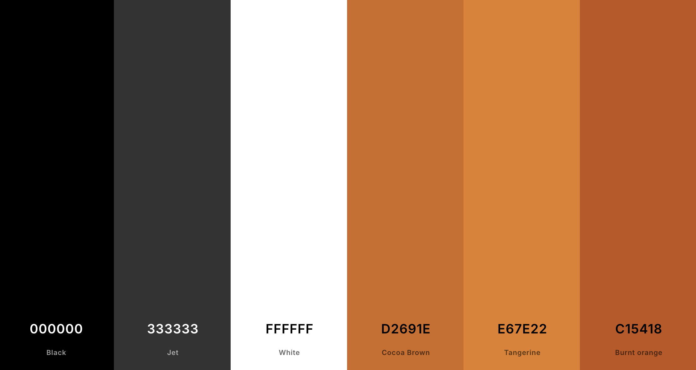
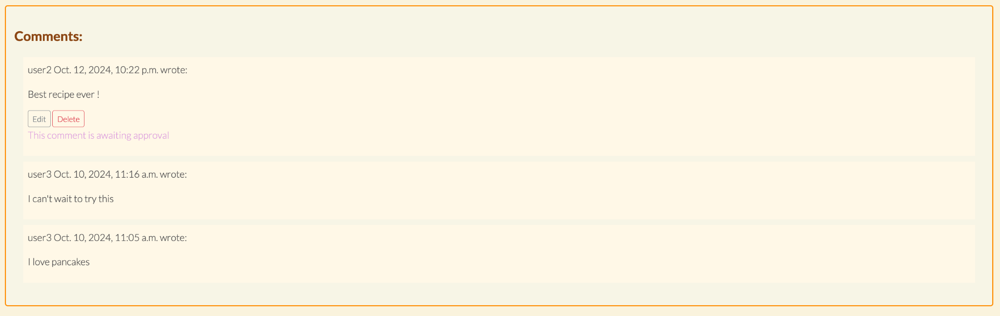
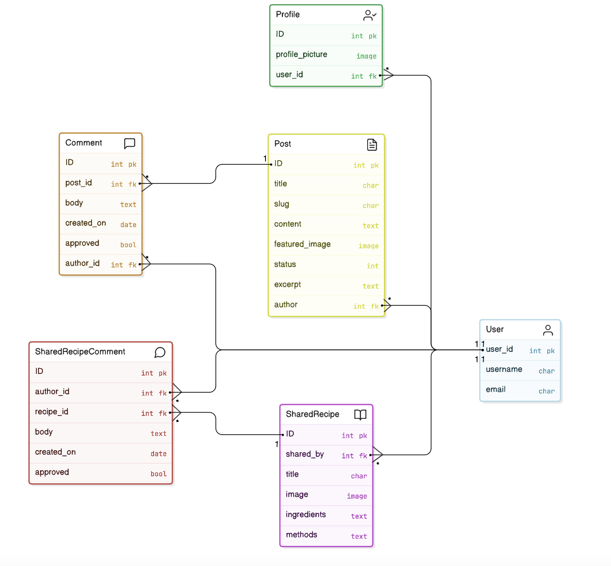

# Recipe Haven


[View The Live Project Here](https://my-project4-recipe-haven-6ab6e72ce69e.herokuapp.com/) <!-- Add link to live site here -->

## Purpose of the Project
Recipe Haven is a community-driven platform for home-cooked meal recipes. This project provides users with a space to discover delicious recipes, share their own, and engage in discussions with fellow food enthusiasts.

When users visit Recipe Haven, they are welcomed with a homepage that encourages them to explore popular recipes. Registered users can access additional features, such as sharing their own recipes and participating in the comments section.

## Table Of Contents
1. [Introduction](#Introduction)
    1. [Scenario](#Scenario)
2. [UX](#UX)
    1. [User Stories](#User-Stories)
    2. [Design Thinking](#Design-Thinking)
    3. [Colour Scheme](#Colour-Scheme)
3. [Features](#Features)
    1. [Design Features](#Design-Features)
    2. [Existing Features](#Existing-Features)
       1. [Public User Features](Public-User-Features)
       2. [Private User Features](Private-User-Features)
       3. [Admin/Staff Features](Admin/Staff-Features)
    3. [Future Adaptations](#Future-Adaptations)
4. [Technologies Used](#Technologies-Used)
    1. [Main Languages Used](#Main-Languages-Used)
    2. [Frameworks, Libraries & Programs Used](#Frameworks,-Libraries-&-Programs-Used)
5. [Database Design](#Database_Design)
6. [Testing](#Testing)
7. [Issues and Bugs](#Issues-and-Bugs)
8. [Deployment](#Deployment)
9. [Credits](#Credits)
10. [Acknowledgements](#Acknowledgements)

---

## Introduction
Recipe Haven

Welcome to Recipe Haven! A community platform where users can discover, share, and explore delicious home-cooked recipes.

### Scenario

In today’s digital age, the joy of cooking and sharing recipes is more accessible than ever. Recipe enthusiasts no longer have to rely solely on printed cookbooks or traditional word-of-mouth sharing. Platforms like Recipe Haven allow users to connect over their love of food, explore new cuisines, and contribute their own culinary creations to a growing collection of recipes.

Consider Recipe Haven as the perfect digital space for home cooks who want to share their favorite family dishes, create new recipes, or simply find inspiration for their next meal. While many may enjoy browsing recipes online, some want to go a step further by contributing their own creations to a community of like-minded food lovers.

Recipe Haven’s user-friendly interface allows individuals to create an account, upload their recipes, and comment on others’ posts, fostering a sense of connection and collaboration in the kitchen. Additionally, the platform caters to both novice and experienced cooks, giving everyone a chance to engage, learn, and share in a space that celebrates all things food.

In a world where time is precious and convenience is key, Recipe Haven gives users the ability to browse and share recipes at any time, from any place. Whether it's a quick dinner idea or a complex holiday meal, the platform offers a wealth of options for any occasion. With these capabilities, Recipe Haven enhances the traditional experience of sharing recipes, bringing it into the modern age of connectivity and digital interaction.

With the above in mind, let's explore Recipe Haven together!

## UX
### User Stories
Recipe Haven serves three types of users: the site owner (admin), public users, and private users (registered and signed-in users). The following user stories were considered during development:

- As a public user, I want to browse popular and new recipes without needing to sign up so that I can quickly explore the platform and find inspiration.

- As a public user, I want to view recipes and their details without creating an account so that I can decide whether I want to join the platform.

- As a private user, I want to create an account and log in so that I can share my own recipes with the community.

- As a private user, I want to submit detailed recipes, including ingredients, methods, and images, so that others can recreate my dishes.

- As a private user, I want to view my shared recipes and manage my profile so that I can track my contributions, as well as edit or delete the recipes I have shared.

- As a private user, when I register, a profile is automatically created where I can view the recipes I have shared.

- As a private user, I want to comment on recipes shared by others so that I can engage with the community and share feedback or ask questions.

- As a public or private user, I want to access a Frequently Asked Questions (FAQ) section so that I can find answers to common questions without needing to contact support.

- As a site owner (admin), I want to be able to moderate content on the platform to ensure that all shared recipes and comments align with community standards.

- As a site owner (admin), I want to have an admin dashboard to efficiently oversee user activities, recipe submissions, and comments, and take necessary actions if required.

- Private users see a toast notification displayed when i make changes.

All detailed user stories can be found in a linked GitHub project [here](https://github.com/users/Tenda-M/projects/3/views/1)

### Design Thinking
The platform is designed to offer a user-friendly and visually appealing experience. Its simple navigation, clean design, and responsive layout ensure users can easily explore and share recipes.

Recipe Haven was designed with simplicity, accessibility, and functionality in mind. Key considerations during the design process were:

- User Experience: The platform ensures that users of all technical abilities can easily navigate the site, whether they are browsing, sharing, or managing recipes. The interface is clean and intuitive, keeping the focus on the content.

- Mobile-First Approach: With a wide range of devices in mind, Recipe Haven is fully responsive. This ensures users can browse and share recipes seamlessly whether using a desktop, tablet, or mobile phone.

- Community Engagement: Recipe Haven fosters a sense of community by encouraging interaction through recipe sharing and commenting. Users can contribute to the conversation around recipes, exchanging tips and feedback.

- Accessibility: Accessibility is a priority to ensure all users, including those with disabilities, can access the platform. Features such as high-contrast text, alt text for images, and keyboard navigation have been implemented to provide an inclusive experience.

### Colour Scheme
The color scheme features a soft, neutral palette of whites and light greys, complemented by a warm, earthy accent color reminiscent of a kitchen or home-cooking environment. This subtle yet welcoming design is consistent throughout the site, creating a cohesive and pleasant user experience.

I used [coolors.co](https://coolors.co/000000-333333-ffffff-d2691e-e67e22-c15418-d35400-263e21) to generate my colour palette.



## Features
### Design Features
- A modern, responsive design that adapts to various screen sizes.
- Flexbox-based layout for recipe cards ensuring consistent alignment.
- Interactive navigation, including a dropdown menu for FAQ and About sections.

### Existing Features

#### Existing Features
- **Homepage**
 - Home: Takes users back to the homepage. The homepage prominently displays three recipe cards in each row, each featuring an image, recipe title, author, description, and post date.

 

- **About Page**
 - The About page of Recipe Haven features a welcoming message from the site owner, introducing the platform as a space for sharing home-cooked meal recipes and building a community of food lovers. It includes a clear and inviting layout with a personal note encouraging user participation. The page is simple yet informative, providing users with an overview of the platform's purpose and mission.


- **FAQ Page**
- The FAQ page of Recipe Haven features a clean and simple design with a list of frequently asked questions displayed in a dropdown accordion format. Users can click on each question to reveal the corresponding answer, making the page easy to navigate. The page provides helpful guidance on topics.


- **Contact Page**
 - The Contact Us page of Recipe Haven features a simple and clean contact form where users can reach out with questions, feedback, or collaboration ideas. The form includes fields for the user's Name, Email, and Message, ensuring that communication is streamlined. A clear Submit button is provided at the bottom, making it easy for users to send their inquiries or feedback directly to the site owner.


- **Register Page**
 - The Register page of Recipe Haven allows new users to create an account by filling out a simple form. The form includes fields for Username, Email (optional), and a Password, which must meet security guidelines displayed below the fields. A clear Sign Up button is provided at the bottom, and there is an option to Sign in for users who already have an account, ensuring easy navigation for both new and returning users.


- **Login Page**
 - The Login page of Recipe Haven features a simple form for users to sign in using their Username and Password. A checkbox for Remember Me allows users to stay logged in on their device. A Sign In button is prominently displayed below the form, with links provided for users who need to register or reset their password, ensuring seamless navigation for both existing and new users.

 - 

#### Private User Features

- **Share Page**
The "Share" page in Recipe Haven allows logged-in users to submit their recipes. Users can fill in details such as the title, upload an image, and provide the ingredients and methods for the recipe. The form ensures that all required fields are filled before submission, and users can preview their shared recipes after submission. The page promotes community participation by encouraging users to contribute recipes with detailed instructions.


- ***Shared recipe section***
The "Shared Recipes" section on the Share page displays a list of recipes contributed by users, featuring an image, a brief excerpt of the ingredients, and the cooking methods. Each recipe card includes a link to view the full recipe and details about the user who shared it. The layout is designed for easy browsing, allowing users to quickly access and explore a variety of recipes shared within the community.


- ***Shared recipe full page***
The full shared recipe section presents a large image of the dish on the right-hand side, with the recipe title and ingredients list and methods on the left, ensuring clarity and organisation. Below the recipe, there is a comments section where users can leave feedback. If there are no comments, a message invites users to be the first to comment.


- **Logout Page**
The Logout page of Recipe Haven provides a simple confirmation prompt asking users if they are sure they want to log out. A prominent Sign Out button is displayed in a bright color, making it easy for users to complete the action. The minimalistic design ensures clarity, with no distractions, allowing users to quickly confirm their choice to log out.


- **Profile Page**
 - The Profile page of Recipe Haven allows users to view and manage their account details and recipes. At the top, users can see their username and email displayed, along with a profile icon. Below, the Your Recipes section lists the user's shared recipes, with options to Edit or Delete each recipe. This page provides a simple and intuitive interface for managing personal contributions to the platform.


- ***Edit recipe Page***
 - The Edit Recipe page of Recipe Haven allows users to modify existing recipes. It includes fields for editing the Title, Author, Ingredients, and Methods of the recipe, as well as an option to update the Image. Users can select a new image using the Browse button or leave it unchanged. At the bottom, a Save Changes button allows users to submit their updates and save the modifications to the recipe.


- ***Delete recipe Page***
 - The Delete Recipe page of Recipe Haven provides users with a clear confirmation prompt, asking if they are sure about deleting a specific recipe (in this case, "edited boiled eggs"). The page offers two distinct options: a bright Delete button for confirming the deletion and a Cancel button for aborting the action. This ensures that users can carefully confirm their decision before removing content from the platform.


#### Notifications

- ***Login notification***


- ***Logout notification***


- ***shared recipe notification***


- ***Large image notification***


- ***submit comment notification***


- ***Edit comment notification***


- ***Delete comment notification***


#### Comments
The comments section allows users to leave feedback on shared recipes. Users can edit or delete their own comments, and the system notifies them when a comment is awaiting approval. Comments from other users are displayed along with the submission time, fostering interaction and discussion around the recipes.


- ***Edit comment***


- ***Delete comment***


#### Admin/Staff Features
- ***Admin approve comment***


- ***Admin Delete comment***


### Future Adaptations
Future Features

- Rating System: In future development, users will be able to rate recipes, helping others to find the most popular or highly-rated options.

    - Private users can rate recipes using a likes system .
    - Each recipe displays the average rating, calculated based on all submitted user ratings.
    - Users are only allowed to rate a recipe once but may update their rating if needed.
    - The most highly-rated recipes are featured in a “Top Recipes” section.

- Advanced Recipe Search: Users will have the ability to search for recipes using filters like ingredients, meal type, and dietary preferences to find exactly what they’re looking for.

    - Users can filter recipes by various categories, including ingredients, meal type (e.g., breakfast, lunch, dinner), and dietary preferences (e.g., vegan, gluten-free).
    - Recipes are dynamically displayed based on the selected filters, updating the list without a full page reload.
    - Users can apply multiple filters at once to refine search results (e.g., vegan + dinner).
        Search results display a count of how many recipes match the filters.

- Recipe Sharing on Social Media: Future features will allow users to share their favorite recipes directly on social media platforms to expand their reach.

    - Private users can share their recipes on social media platforms such as Facebook, Twitter, and Instagram with one click.
    - Each recipe page includes share buttons that generate a unique URL and preview for the social media platform.
    - Users are notified of successful sharing via a toast notification.
    - Shared recipes display the number of times they’ve been shared on social media, providing a sense of popularity.

## Technologies Used
- [HTML](https://en.wikipedia.org/wiki/HTML) is used to structure the main content of the site.
- [CSS](https://en.wikipedia.org/wiki/CSS) is used for designing the layout and appearance of the website.
- [CSS Flexbox](https://www.w3schools.com/css/css3_flexbox.asp) is implemented for a responsive layout that adapts to different screen sizes.
- [CSS Grid](https://www.w3schools.com/css/css_grid.asp) is also used for creating flexible, responsive layouts.
- [JavaScript](https://www.javascript.com) is used to enhance user interaction and dynamic elements on the site.
- [Python](https://www.python.org) is used as the back-end programming language, handling server-side functionality.
- [Git](https://git-scm.com) is used for version control, allowing me to track and manage changes (`git add`, `git commit`, `git push`).
- [GitHub](https://github.com) is used for secure online storage of the project code and for collaboration.
- [Gitpod](https://gitpod.io) is the cloud-based integrated development environment (IDE) used for writing and testing code.
- [Bootstrap](https://getbootstrap.com) is used to create a responsive front-end design with pre-built components and styling.
- [Django](https://www.djangoproject.com) is the Python framework used to develop the back-end of the site and manage its functionalities.
- [PostgreSQL](https://www.postgresql.org) is used as the relational database to store data such as user information and recipes.
- [ElephantSQL](https://www.elephantsql.com) is used to host the PostgreSQL database for production.
- [Heroku](https://www.heroku.com) is the hosting platform used to deploy and run the live site.
- [Cloudinary](https://cloudinary.com) is used for managing and hosting static files and images for the site.

### Main Languages Used
- HTML, CSS, JavaScript for frontend development.
- Python (Django) for backend logic.
- SQL (PostgreSQL/MySQL) for database management.

### Frameworks, Libraries & Programs Used
- Django for backend web development.
- Bootstrap for responsive design and layout.
- Cloudinary for image storage.

## Database Design
- While planning this project, I drew up an Entity Relationship Diagram to help me visualise the database models and their relationships.


## Testing
Manual testing was conducted for all key features, including recipe submission,  edit shared recipes, and commenting functionality. Testing ensures that all components work smoothly on various devices and browsers.
For all testing, please refer to the [TESTING.md](documentation]TESTING.md) file.
## Issues and Bugs
- Resolved issues with recipe form submission.
- Adjusted layout for consistent display of recipe cards.
- Ongoing improvements for mobile responsiveness.

## Deployment
- The application was deployed using Heroku, and the database was configured with PostgreSQL.
- Cloudinary was integrated to manage image uploads for recipes.

The following steps for creating and configuring a new Python workspace and API credentials have been informed by and adapted from the Python walkthrough project 'Recipe Haven' by [Code Institute's](https://codeinstitute.net/ie/). Please ensure each step is applicable to your project requirements and adjust the provided data accordingly.

### Creating a new repository 
<details open>
<summary>Steps to create a new repository.</summary>  
The [Code Institute's Python Essential Template](https://github.com/Code-Institute-Org/python-essentials-template) was used to create a terminal for my Python file to generate it's output. 

To utilise this template, adhere to these steps:
1. Sign in to [GitHub](https://github.com/) or register for a new account.
2. Go to the Python template repository provided above.
3. Select '**Use this template**' -> '**Create a new repository**'.
4. Pick a new repository name and choose '**Create repository from template**'.
5. Within your new repository area, click the green '**Gitpod**' button to create a new workspace.

</details> 

#### Deploying to Heroku 
The Recipe Haven project was deployed using [Heroku](https://www.heroku.com) and connected to an external PostgreSQL database hosted on [ElephantSQL](https://www.elephantsql.com). Below is a step-by-step guide to the deployment process:

##### Steps for Deployment:

1. **Set Up the Project Locally**:
   - Ensure that your project is properly set up and working locally before deploying. Install all necessary dependencies listed in `requirements.txt` using the following command:
     ```bash
     pip install -r requirements.txt
     ```

2. **Set Up Heroku**:
   - Log in to your [Heroku](https://dashboard.heroku.com) account.
   - Create a new Heroku app by clicking **New** > **Create New App**.
   - Choose a unique app name and select the region closest to your location.

3. **Set Up PostgreSQL**:
   - In Heroku, go to the **Resources** tab of your app.
   - Under **Add-ons**, search for and add **Heroku Postgres** as your database.
   - Alternatively, use [ElephantSQL](https://www.elephantsql.com) for your PostgreSQL database by creating an instance on ElephantSQL and copying the database URL.
   - In your Heroku app, navigate to **Settings** > **Reveal Config Vars** and set the following environment variables:
     - `DATABASE_URL`: Your PostgreSQL database URL (from either Heroku Postgres or ElephantSQL).
     - `SECRET_KEY`: A secret key for your Django project.
     - `DEBUG`: Set to `False` for production.

4. **Set Up Cloudinary for Static and Media Files**:
   - Sign up for a [Cloudinary](https://cloudinary.com) account to store static files and images.
   - In Heroku’s **Config Vars**, add the following variable:
     - `CLOUDINARY_URL`: Your Cloudinary API environment variable.
   - Update your Django settings to handle static and media files via Cloudinary.

5. **Prepare Your Application for Deployment**:
   - Make sure you have a `Procfile` in the root of your project, specifying how Heroku should run your app:
     ```
     web: gunicorn your_project_name.wsgi
     ```
   - Make migrations for your database:
     ```bash
     python manage.py makemigrations
     python manage.py migrate
     ```
   - Collect static files to be served by Cloudinary:
     ```bash
     python manage.py collectstatic
     ```

6. **Deploy to Heroku**:
   - Connect your Heroku app to your GitHub repository under the **Deploy** tab in Heroku.
   - Enable automatic deploys from the `main` branch, or manually deploy by clicking the **Deploy Branch** button.

7. **Run the App**:
   - Once deployed, your app should be live at `https://your-app-name.herokuapp.com`.
   - Use the **Heroku logs** command to troubleshoot any issues:
     ```bash
     heroku logs --tail
     ```

-----  

### Forking the GitHub Repository

A copy of the original repository can be made through GitHub. Please follow the below steps to fork this repository:  

1. Visit GitHub and sign in.
2. After logging in, access this repository using the following link: [Recipe Haven Repository](https://github.com/Tenda-M/recipe-haven).
3. Above the file section of the repository and located at the top right of the page, you'll find the '**Fork**' button. Click on it to create a fork of this repository.
4. You should now find a forked version of this repository in your GitHub account.

-----  

### Clone this GitHub Repository

A local clone of this repository can be made on GitHub. Please follow the below steps:
1. Go to GitHub and sign in.
2. You can find the [Recipe Haven Repository](https://github.com/Tenda-M/recipe-haven) at this address.
3. Above the section containing repository files, locate the '**Code**' button.
4. Click on it and select your preferred cloning method from HTTPS, SSH, or GitHub CLI. Copy the URL to your clipboard using the '**Copy**' button.
5. Launch your Git Bash Terminal.
6. Navigate to the directory where you want the cloned directory to be created.
7. Enter `git clone` followed by pasting the copied URL from step 4.
8. Hit '**Enter**' to initiate the creation of the local clone.

## Credits
### Content
- Recipe content was provided by the community and contributors.

- The Code Institute's 'Codestar' project provides guidance for setting up Google Sheets API and Credentials: [Code Institute](https://codeinstitute.net/ie/)

- W3Schools provided helpful Python tutorials. [W3Schools](https://www.w3schools.com/python/default.asp)

- The Python Typing Text Effect us was from. [computing.net](https://www.101computing.net/python-typing-text-effect/)

- Use of alert colour [coolors.co](https://coolors.co/000000-333333-a1a1a1-f5f5f5-ffffff-507e50-507948-304f2a-263e21)

- Use of all images [Vecteezy](https://www.vecteezy.com)

- All recipes were taken from the BBC Goodfood website and can be found here [BBC Good Food](https://www.bbc.co.uk/food).

- HTML, CSS, javascript[mdn](https://developer.mozilla.org/en-US/docs/Web/HTML/Element/input/email)

- Use of django urls [django](https://docs.djangoproject.com/en/5.1/ref/urls/)

- Use of profile creation [youtube](https://www.youtube.com/watch?v=FdVuKt_iuSI&list=PL-osiE80TeTtoQCKZ03TU5fNfx2UY6U4p&index=9)

- Use of Bootstrap FAQ Page [bootstrapbrain.com](https://bootstrapbrain.com/component/bootstrap-faq-page-using-accordion/)
  
### People
- Project development and design by [Tatenda Mudehwe].

## Acknowledgements
- I extend my heartfelt gratitude to my family for their unwavering support during discussions on ideas and debugging, as well as for diligently testing my work.
- Special thanks to my mentor, Excellence Ilesanmi, for providing invaluable support and guidance throughout this journey.
- I am deeply thankful to my fellow peers at Code Institute for their invaluable support and camaraderie.
