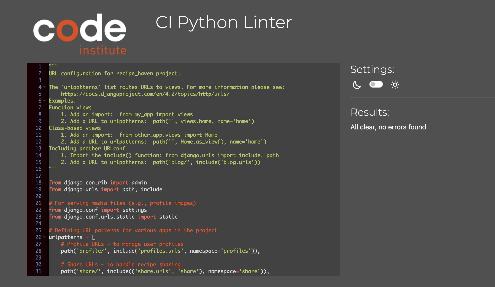
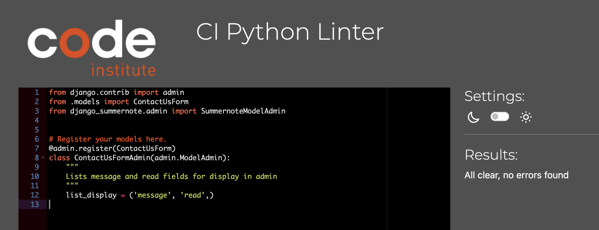
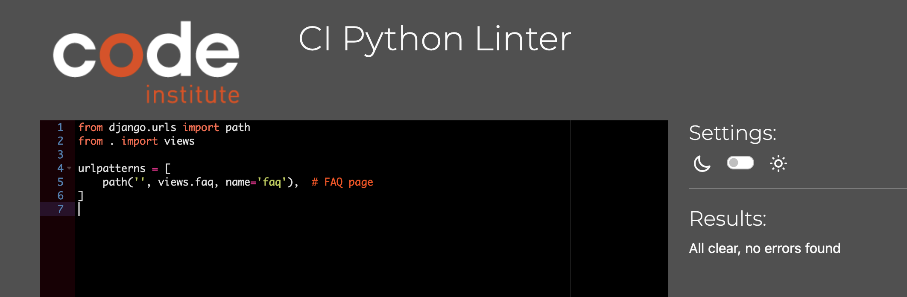

# Testing for Recipe Haven   
  
## Testing Contents  
  
1. [Validation](#validation)
2. [Browser Testing](#browser-testing)
3. [Manual Testing](#manual-testing)
4. [Bugs](#bugs)  
  
  -----
## Validation  
The code was validated using the [Code Institute's](https://pep8ci.herokuapp.com/#) during its development. No errors were found in the final testing, as shown below:

## User Input Validation for Recipe Haven

In Recipe Haven, strong input validation mechanisms are in place to ensure the integrity of user data and deliver a seamless experience. Below are the key validation strategies employed across the application:

### File Size Validation:

    For recipe images uploaded by users, Recipe Haven checks that the file size does not exceed the limit of 10MB. If the image exceeds this limit, users are informed and prompted to upload a smaller file.

### Forms
    
    In Recipe Haven, several input fields are marked as required to ensure that users provide essential information when submitting recipes, comments, or other forms. Below are the key required fields across various forms:
    
#### Recipe Submission Form:

- **Title:** Users must provide a clear and descriptive recipe title. This helps ensure the recipe can be easily identified by others.
- **Image:** A recipe image is required to visually represent the dish. The system prompts users to upload an image that meets the specified file size and format requirements.

#### Comment Submission Form:

- **Body:** Users must provide content when submitting a comment. Empty comments are not allowed, ensuring meaningful engagement on the platform.

#### User Registration Form:

- **Username:** A unique username is required for every user to identify themselves within the Recipe Haven community.
- **Email:** A valid email address is required for user communication and account management.
- **Password:** Users must create a strong password to secure their account. The system enforces password validation to ensure security.

## Browser Testing 
Baker's Heart was tested on the Heroku app website across multiple browsers, including Google Chrome, Mozilla Firefox, and Safari, without encountering any issues.

-----

## Manual Testing  

### Testing Features 

| Feature                        | Tested?  | User Feedback Provided                                        |
|---------------------------------|----------|---------------------------------------------------------------|
| Home Page                       | Yes      | Home page loads successfully with links to key features       |
| Navbar Active State (Home)      | Yes      | Navbar 'Home' link changes color when user is on home page    |
| About Page                      | Yes      | About page loads successfully with relevant content           |
| FAQ Page                        | Yes      | FAQ page accessible from dropdown, loads successfully         |
| Dropdown Menu Functionality     | Yes      | Dropdown menu works correctly to access FAQ and About pages   |
| Contact Us Page                 | Yes      | Contact page loads and displays the contact form              |
| Contact Us Form                 | Yes      | Users can submit the contact form successfully                |
| Contact Us Feature              | Yes      | Contact submissions are stored and trigger success message    |
| Share Page                      | Yes      | Share page loads successfully and displays share form         |
| Share Form                      | Yes      | Share form validates input and uploads recipe successfully    |
| Shared Recipe Page              | Yes      | Users can click on shared recipes, and the recipe page loads  |
| Comment Submission (Recipes)    | Yes      | Comments successfully submitted with confirmation message     |
| Recipe Sharing Form             | Yes      | Missing fields (ingredients, methods) prompt error messages   |
| Image Upload Validation         | Yes      | Image exceeds 10MB size limit triggers an error message       |
| Log In Page                     | Yes      | Log in page loads successfully and allows users to log in     |
| Log Out Page                    | Yes      | Log out functionality works, users are logged out successfully|
| Register Page                   | Yes      | Registration page loads successfully with form input validation|
| Register Form                   | Yes      | Users can register with validation, form submission successful|
| Profile Page                    | Yes      | Profile page displays user information and shared recipes     |
| Recipe Edit Feature             | Yes      | Successful edits redirect to user profile with confirmation   |
| Recipe Deletion Feature         | Yes      | Successful deletion triggers a confirmation message           |
| Pagination for Recipe List      | Yes      | Pagination works as expected, smooth navigation               |
| Recipe Detail View              | Yes      | Recipe detail page displays image, title, ingredients, and methods |
| Form Validation for Sharing     | Yes      | Invalid inputs (e.g., missing fields) trigger validation errors|

### Testing Navbar 
| Navbar Link                    | Tested?  | User Feedback Provided                                        |
|---------------------------------|----------|---------------------------------------------------------------|
| Navbar Active State (Home)      | Yes      | Navbar 'Home' link changes color when user is on home page    |
| Navbar Active State (About)     | Yes      | Navbar 'About' link changes color when user is on About page  |
| Navbar Active State (Share)     | Yes      | Navbar 'Share' link changes color when user is on Share page  |
| Navbar Active State (Login)     | Yes      | Navbar 'Login' link changes color when user is on Login page  |
| Navbar Active State (Contact Us)| Yes      | Navbar 'Contact Us' link changes color when user is on Contact Us page |
| Navbar Active State (Logout)    | Yes      | Navbar 'Logout' link changes color when user is logged out    |
| Navbar Active State (Profile)   | Yes      | Navbar 'Profile' link changes color when user is on Profile page |

### Testing User Stories 
| User Story                                                                                                                            | Feature                              | Tested? | User Feedback Provided                                     |
|---------------------------------------------------------------------------------------------------------------------------------------|--------------------------------------|---------|------------------------------------------------------------|
| 1. As a public user, I want to browse popular and new recipes without needing to sign up so that I can quickly explore the platform.   | Browse Recipes                      | Yes     | Public users can browse recipes without signing up.         |
| 2. As a public user, I want to view recipes and their details without creating an account so that I can decide whether to join.        | View Recipe Details                  | Yes     | Recipe details are fully visible without signing up.        |
| 3. As a private user, I want to create an account and log in so that I can share my own recipes with the community.                    | User Registration and Login          | Yes     | Users can register, log in, and start sharing recipes.      |
| 4. As a private user, I want to submit detailed recipes, including ingredients, methods, and images, so others can recreate my dishes. | Submit Recipe Form                   | Yes     | Users can submit recipes with ingredients, methods, and images. |
| 5. As a private user, I want to view my shared recipes and manage my profile to track, edit, or delete my shared recipes.              | Manage Shared Recipes                | Yes     | Users can edit or delete their shared recipes.              |
| 6. As a private user, when I register, a profile is automatically created where I can view the recipes I have shared.                  | Automatic Profile Creation           | Yes     | Profiles are automatically created upon registration.       |
| 7. As a private user, I want to comment on recipes shared by others to engage with the community and share feedback or ask questions.  | Comment on Shared Recipes            | Yes     | Users can comment on recipes and engage with the community. |
| 8. As a public or private user, I want to access a FAQ section to find answers to common questions without needing to contact support. | FAQ Section                          | Yes     | FAQ section is accessible via the dropdown.                 |
| 9. As a site owner (admin), I want to moderate content on the platform to ensure recipes and comments align with community standards.  | Content Moderation                   | Yes     | Admins can moderate recipe and comment content.             |
| 10. As a site owner (admin), I want an admin dashboard to efficiently oversee user activities, recipe submissions, and comments.      | Admin Dashboard                      | Yes     | Admin dashboard allows efficient oversight of activities.   |
| 11. As a private user, I want to see a toast notification when I make changes, such as editing or deleting a recipe.                   | Toast Notifications                  | Yes     | Toast notifications are shown for recipe edits and deletions. |

 

## Bugs 

### Bugs Found and Fixed in Recipe Haven Project

1. **Bug: Recipe Detail Page 500 Server Error**  
   **Issue**: Clicking on a shared recipe sometimes resulted in a 500 server error.  
   **Fix**: Updated the `share/views.py` to properly handle the form submission and ensured the recipe details page displayed correctly when accessed.

2. **Bug: Comment Form Not Displaying**  
   **Issue**: The comment form was not appearing on the shared recipe detail page, preventing users from submitting comments.  
   **Fix**: Corrected the `recipe_detail.html` template and linked the comment form properly, ensuring it is rendered on the page.

3. **Bug: Layout Issue with Recipe Cards**  
   **Issue**: The 'View Full Recipe' button on recipe cards was being pushed down due to inconsistent image sizes.  
   **Fix**: Applied consistent card heights and utilized Flexbox for layout adjustments, ensuring buttons aligned correctly regardless of image size.

4. **Bug: Shared Recipe Form Not Submitting**  
   **Issue**: The form on the share recipe page was not submitting properly, causing no recipes to be saved.  
   **Fix**: Updated the `share_page_view` function to correctly handle form data and save submissions, ensuring the form worked as intended.

   

## Known Bugs  
After rigorous testing, there are no known bugs in the code.

## Responsiveness

## Code validation
  ### HTML

I have validated all of my HTML files using the recommended [W3C HTML Validator](https://validator.w3.org).

  | Page | W3C URL | Screenshot | Notes |
| --- | --- | --- | --- |
| Home | [W3C](https://validator.w3.org/nu/?doc=https%3A%2F%2Fbushy-park-tennis-club-896947b1504e.herokuapp.com%2F) |  | Pass: No Errors |
| About | [W3C](https://validator.w3.org/nu/?doc=https%3A%2F%2Fbushy-park-tennis-club-896947b1504e.herokuapp.com%2F) |  | Pass: No Errors |
| FAQ | [W3C](https://validator.w3.org/nu/?doc=https%3A%2F%2Fbushy-park-tennis-club-896947b1504e.herokuapp.com%2F) |  | Pass: No Errors |
| Contact | [W3C](https://validator.w3.org/nu/?doc=https%3A%2F%2Fbushy-park-tennis-club-896947b1504e.herokuapp.com%2F) |  | Pass: No Errors |
| Base | [W3C](https://validator.w3.org/nu/?doc=https%3A%2F%2Fbushy-park-tennis-club-896947b1504e.herokuapp.com%2F) |  | Pass: No Errors |
| Post-detail | [W3C](https://validator.w3.org/nu/?doc=https%3A%2F%2Fbushy-park-tennis-club-896947b1504e.herokuapp.com%2F) |  | Pass: No Errors |
| share | [W3C](https://validator.w3.org/nu/?doc=https%3A%2F%2Fbushy-park-tennis-club-896947b1504e.herokuapp.com%2F) |  | Pass: No Errors |
| share_detail | [W3C](https://validator.w3.org/nu/?doc=https%3A%2F%2Fbushy-park-tennis-club-896947b1504e.herokuapp.com%2F) |  | Pass: No Errors |
| login | [W3C](https://validator.w3.org/nu/?doc=https%3A%2F%2Fbushy-park-tennis-club-896947b1504e.herokuapp.com%2F) |  | Pass: No Errors |
| log out| [W3C](https://validator.w3.org/nu/?doc=https%3A%2F%2Fbushy-park-tennis-club-896947b1504e.herokuapp.com%2F) |  | Pass: No Errors |
| Profile | [W3C](https://validator.w3.org/nu/?doc=https%3A%2F%2Fbushy-park-tennis-club-896947b1504e.herokuapp.com%2F) |  | Pass: No Errors |
|Register| [W3C](https://validator.w3.org/nu/?doc=https%3A%2F%2Fbushy-park-tennis-club-896947b1504e.herokuapp.com%2F) |  | Pass: No Errors |

  ### CSS
   I have used the recommended [CSS Jigsaw Validator](https://jigsaw.w3.org/css-validator) to validate all of my CSS files.
   | File      | Jigsaw URL | Screenshot | Notes              |
|-----------|------------|------------|--------------------|
| style.css | [Jigsaw](https://jigsaw.w3.org/css-validator/validator) | | Pass: No Errors |

  ### Python

I have used the recommended [PEP8 CI Python Linter](https://pep8ci.herokuapp.com) to validate all of my Python files.
#### Validation For Recipe Haven App

| File | CI URL | Screenshot | Notes |
| --- | --- | --- | --- |

| File        | CI URL      | Screenshot                                                                                       | Notes           |
|-------------|-------------|--------------------------------------------------------------------------------------------------|-----------------|
| settings.py | [PEP8 CI]() |                                    | Pass: No Errors |
| urls.py     | [PEP8 CI]() |          | Pass: No Errors |
| wsgi.py     | [PEP8 CI]() |                | Pass: No Errors |

#### Validation For about App
| File | CI URL | Screenshot | Notes |
| --- | --- | --- | --- |
| admin.py | [PEP8 CI]() |  | Pass: No Errors |
| apps.py | [PEP8 CI]() |  | Pass: No Errors |
| models.py | [PEP8 CI]() |  | Pass: No Errors |
| urls.py | [PEP8 CI]() |  | Pass: No Errors |
| views.py | [PEP8 CI]() |  | Pass: No Errors |

#### Validation For blog App
| File | CI URL | Screenshot | Notes |
| --- | --- | --- | --- |
| admin.py | [PEP8 CI]() |  | Pass: No Errors |
| apps.py | [PEP8 CI]() |  | Pass: No Errors |
| forms.py | [PEP8 CI]() |  | Pass: No Errors |
| models.py | [PEP8 CI]() |  | Pass: No Errors |
| urls.py | [PEP8 CI]() |  | Pass: No Errors |
| views.py | [PEP8 CI]() |  | Pass: No Errors |

#### Validation For contact App
| File | CI URL | Screenshot | Notes |
| --- | --- | --- | --- |
| admin.py | [PEP8 CI]() |  | Pass: No Errors |
| apps.py | [PEP8 CI]() |  | Pass: No Errors |
| forms.py | [PEP8 CI]() |  | Pass: No Errors |
| models.py | [PEP8 CI]() |  | Pass: No Errors |
| urls.py | [PEP8 CI]() |  | Pass: No Errors |
| views.py | [PEP8 CI]() |  | Pass: No Errors |

#### Validation For faq App
| File | CI URL | Screenshot | Notes |
| --- | --- | --- | --- |
| admin.py | [PEP8 CI]() |  | Pass: No Errors |
| apps.py | [PEP8 CI]() |  | Pass: No Errors |
| models.py | [PEP8 CI]() |  | Pass: No Errors |
| urls.py | [PEP8 CI]() |  | Pass: No Errors |
| views.py | [PEP8 CI]() |  | Pass: No Errors |

#### Validation For profiles App
| File | CI URL | Screenshot | Notes |
| --- | --- | --- | --- |
| admin.py | [PEP8 CI]() |  | Pass: No Errors |
| apps.py | [PEP8 CI]() |  | Pass: No Errors |
| models.py | [PEP8 CI]() |  | Pass: No Errors |
| urls.py | [PEP8 CI]() |  | Pass: No Errors |
| views.py | [PEP8 CI]() |  | Pass: No Errors |

## Lighthouse Audit

I have tested my deployed project using the Lighthouse Audit tool to identify and address any major performance, accessibility, SEO, and best practices issues.

### Website App Templates -
| Page | Size | Screenshot | Notes |
| --- | --- | --- | --- |
| Home | Desktop |  | Some minor performance warnings |
| About | Desktop |  | Some minor performance warnings |
| News | Desktop |  | Warning about link text (ignored as link is a Bootstrap button) |
| Contact | Desktop |  | No warnings |
| Base | Desktop |  | No warnings |
| Post-Detail | Desktop |  | No warnings |
| Post-Form | Desktop |  | No warnings |
| Post-Confirm-Delete | Desktop |  |
[Return to README](README.md)

[def]: documentation/validation_settings.png